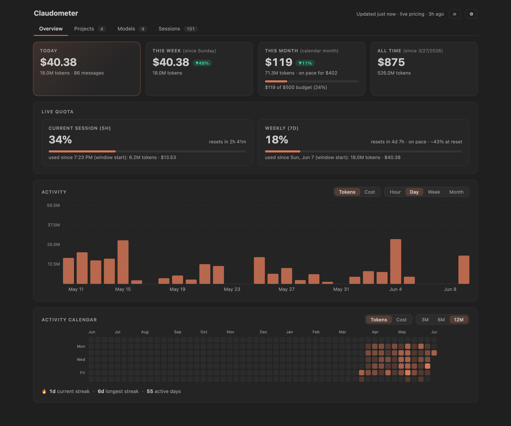
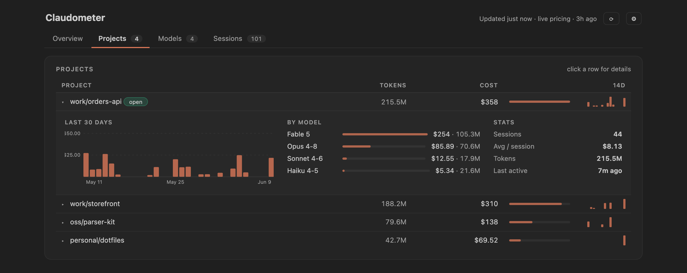

# Claudometer

[](https://marketplace.visualstudio.com/items?itemName=omkar-patel.claudometer)

Track what Claude Code actually costs you, inside VS Code.

Claude Code writes a log of every session to `~/.claude`. Claudometer reads those logs and shows your spend, tokens, and live rate limits in the status bar and a dashboard. No API keys, no accounts, no telemetry.



## What it does

- Cost today / this week / this month, with a pace projection and an optional budget
- Live 5-hour and weekly quota from Anthropic's rate-limit headers, with a burn forecast that knows your weekly rhythm, and optional alerts — including "notify me when the window resets"
- Activity charts by hour, day, week, or month, and a contribution calendar with streaks
- Per-project and per-model breakdowns, tool usage stats, recent sessions
- A local ledger that keeps your history after Claude Code deletes old transcripts (it does, after ~30 days) — export it as CSV or JSON whenever
- Pricing refreshes daily from [models.dev](https://models.dev), so new models are costed correctly without waiting for an extension update. You can override any model's rates in settings.



## Privacy

Everything stays on your machine. There are exactly two network calls, both optional:

- a ~1-token request to `api.anthropic.com` using the sign-in Claude Code already stores, to read your quota headers — `claudometer.quota.enabled`
- a daily anonymous fetch of public model prices from models.dev — `claudometer.pricing.autoUpdate`

Turn both off and it works fully offline. The ledger is a local JSON file of daily totals — never message content.

## Requirements

Claude Code, signed in and used at least once. VS Code 1.85+. Live quota works on any subscription (Pro, Max, Team, Enterprise) and degrades gracefully without one.

## A note on the numbers

Dollar figures are computed from public API list prices. Subscription plans don't bill per token, so read them as API-equivalent value, not an invoice.

## Configuration

Run **Claudometer: Open Settings** (or click ⚙ in the dashboard) for status bar toggles, budget, alerts, the pricing table, and data export/import. Everything is an ordinary `claudometer.*` VS Code setting underneath.

## Development

```
npm install
npm run watch   # esbuild watch
npm test        # vitest
```

Press F5 to launch an Extension Development Host. Screenshots are regenerated with the harness in `scripts/demo/`.

## License

MIT
